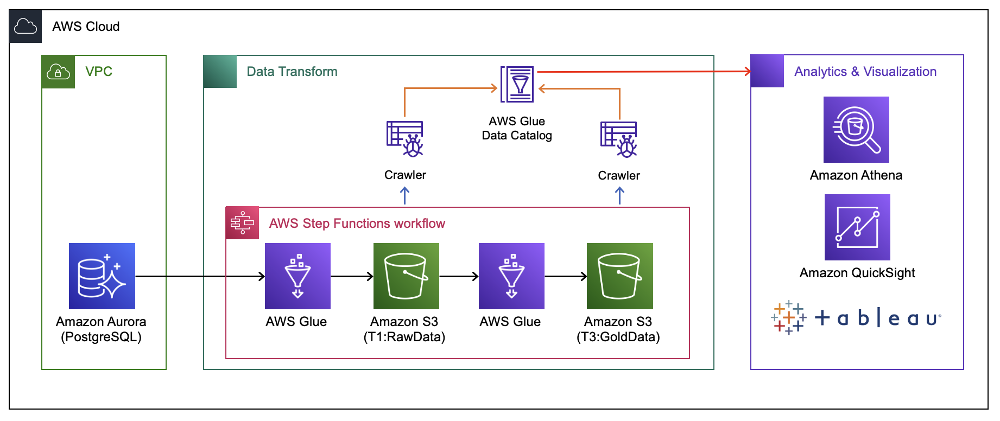
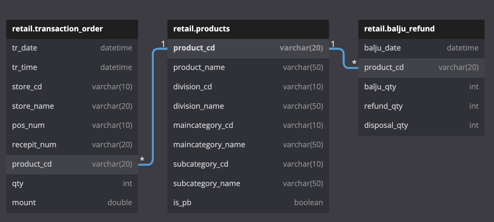

# BATCH Data Pipeline Workshop_Offline 강의

## Tips

💡 1. 제공된 학습 내용에서 `사진` 이 잘 안보일 경우 더블클릭을 통해 확대 가능. 
2. 코드의 경우 마우스 오버를 하게 되면 `복사` 버튼을 통해 쉽게 복사 가능.

# 목적

💡 OnPremise에 있는 OLTP성 데이터를 AWS 서비스를 활용하여 어떻게 ELT 또는 ELT 작업을 수행하는지 Pipeline 구성 방법과 Aanlytics 서비스 사용방법에 대해서 학습한다.

## 1. 강의의 목적

- `Data Engineering 역량강화 인원`에 대해 온라인 강의 수강 후 실제 데이터를 활용하여 전반적인 Data Engineering에 대한 복습과 함께 DB에 적재되어있는 많은 양의 데이터를 추출하여 간단한 Data Lake를 구성하고 해당 데이터를 변환 과정을 통해 사용자가 원하는 형태로 서비스를 제공하는 것을 간략하게 경험해보는 것.

## 2. 해당 `Hands-on` Pipeline의 목적 및 주제

- 현재 A사의 편의점 1개 지점에서 매일 발생되는 거래, 발주 데이터를 바탕으로 해당 매출 확인 및 매출 증대를 위한 전략 수립의 목적으로 Dash Board를 구성하려고 한다.

## 3. 강의 기준

- AWS 서비스를 전혀 사용해보지 못한 사용자를 기반으로 설명.

# AWS Data Architecture

AWS 환경에서의 Data Architure를 확인하고 어떤 흐름으로 Pipeline이 흘러가는지 확인 후 실습 진행.

- 현재는 AWS RDS를 통해 OLTP DB를 구성.
- 하지만 기존 On-Promise에 설치된 DB에서도 동일한 방법으로 수행이 가능.
    - `JDBC`를 통해 `Glue ETL` 작업을 수행.

# Data

## 1. Data Schema

- 사용할 데이터(`XX 편의점` - Retail)
    - 매출 데이터 (receipt_all_final_no_duplicate.csv)
        - 기간 : 2015.01.01 ~ 2017.08.31
        - 35만건(고유 영수증)
        - 구매 상품,수량,시간, 멤버십(성별,나이)
    - 발주 데이터 (balju_refund_final.csv)
        - 기간 : 2015.01.01 ~ 2017.08.31
        - 20만건
        - 상품명, 발주 일자, 발주 수량
    - 폐기 데이터 (balju_refund_final.csv)
        - 기간 : 2015.01.01 ~ 2017.08.31
        - 4,500 건
        - 상품명, 일자, 수량
    - 상품 마스터(product_no_duplicate.csv)
        - 외부 상품
        - PB 상품

## 2. 업무 프로세스

1. 거래 트랜잭션 데이터가 RDS에 저장.
2. 매일 밤 발주, 반품, 폐기 데이터 생성 후 RDS에 저장.
3. `일별 Batch` → `S3`로 저장
    1. RawData
    2. SilverData(일별)
        1. 일별 데이터를 기반으로 합산
        2. 일별 / 시간별 매출 
        3. 일별 / 시간별 소분류별 매출 
        4. 일별 / 시간별 제품별 매출 
        5. 일별 / 소분류별 발주 
    3. GoldData(일별, ~~주별, 월별~~) → 주/월별 생성은 해당 WorkShop에 포함되지 않음.
        1. 일별 생성을 바탕으로 주/월 별로 Step을 구성하여 만들면 됨.
4. `월별` - 데이터 합산(일별 데이터)
    1. 해당 Workshop에는 포함되지 않으나 필요하다면 일별과 동일한 방법으로 구성 가능.

# 실습 전 수행사항

- [DBeaver 설치](https://dbeaver.io/download/)  → 사용하고 계신 DBMS Tool이 있으시면 해당 제품 사용하여도 무관.
- [데이터 다운로드](https://drive.google.com/drive/folders/1oOVQ9o3Rtda0Iv62ZiiT5YeB0coMb2ju?usp=share_link)

# 실습

1. [S3 버킷 및 폴더 생성](./documents/step1_s3.md)
2. [VPC, EndPoint, Security Group 생성](./documents/step2_vpc(network).md)
    1. `(수정) EndPoint 생성 불필요.`
3. [RDS 생성 및 데이터 Import ](./documents/step3_rds.md)
4. [AWS Secrets Manager 생성](./documents/step4_secretsmanager.md)
5. [Glue Job, Crawler 생성](./documents/step5_glue.md)
6. [Lambda, Step Function 생성(옵션, 실습 시간이 되면 수행)](./documents/step6_stepfunction.md)
    1. [`(수정) Airflow 내용 추가`](./documents/step6_reference_airflow.md)
7. [QuickSight Dashboard 구성(옵션, 실습 시간이 되면 수행)](https://github.com/byungjun0689/aws-quicksight-hist-examples)
